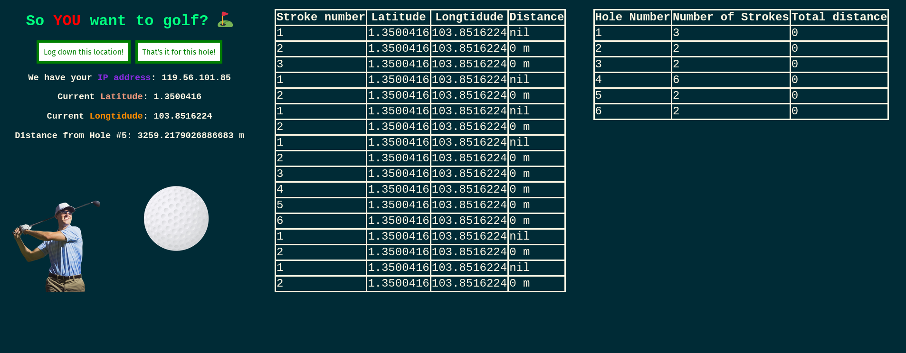

<h1>simple golf location tracker</h1>

> **THIS SOFTWARE IS UNFINISHED. Don't have any high expectations!**

Built in Typescript, HTML and CSS. Runs on in-browser `navigator` tooling.

---

<h3>Technologies used:</h3>

<h3>What I learned:</h3>

* Communicating with APIs on Typescript
* Dynamic Website design with basic Typescript-HTML interaction
* CSS Flexboxes
* HTML, CSS in general *(surprisingly fun)*

<h3>To do:</h3>

* [ ] beautify website interface with proper CSS (use CSS flex boxes)
* [ ] performant improvements
* [ ] optimise for mobile users
* [ ] try running on local phone device

<h3>Done:</h3>

* [x] call Geolocation API
* [x] create table for up to 100 lat long coords to be displayed to
* [x] implement a system to save actual hole distance amassed per hit into a giant list
* [x] implement an overall list that saves the total number of hits and distances for every hole
* [x] counter that checks what lat long coordinate this is
* [x] handle calculation of distance per coord pair

---

<h3>Functionality:</h3>

* Records current location data 
* Displays distance from current location to next hole
* Calculates straight-line distance between current and previous point
* Calculates total distance and number of strokes per hole
* Allows for customization of hole coordinates for different courses

<h3>Screenshots:</h3>

